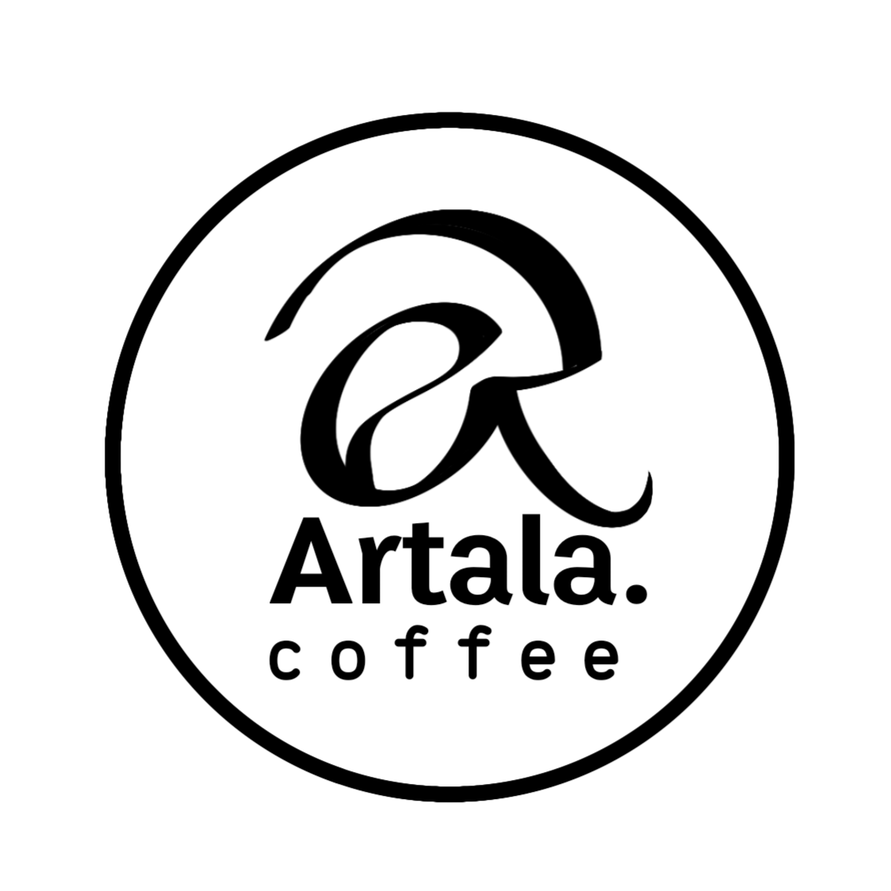

<head>
  <meta charset="UTF-8">
  <meta name="viewport" content="width=device-width, initial-scale=1.0">
  <title>Artala Coffee</title>
  <link rel="stylesheet" href="style.css">
  
</head>
<body>
  <header>
     
    <h1>Artala.Coffee</h1>
    
Tenang di Luar, Fokus di Dalam

  </header>

  <nav>
    <a href="#tentang">Tentang</a>
    <a href="#menu">Menu</a>
    <a href="#lokasi">Lokasi</a>
  </nav>

  <section id="tentang">
    <h2>Tentang Artala</h2>
    
Secara harfiah, "Artala" berarti orang yang memiliki cita-cita tinggi dan mulia seperti rembulan. Maka Artala.Coffee hadir sebagai tempat ngopi bagi mereka yang mengejar impian besar, namun tetap butuh jeda dan ketenangan.

    
Artala.coffee lahir dari dua pikiran, ayah dan anak yang berbeda pandangan, tapi satu tujuan. Kenapa bisa begitu? Ya, itu bagian dari rahasianya… tapi yang pasti, dari perbedaan itu lahirlah satu visi: menciptakan ruang di mana mimpi dan kopi bisa tumbuh bersama.
 

Nama Artala dipilih karena kami yakin bahwa seorang pemimpi yang mempunyai cita-cita tinggi layaknya rembulan (indah meski sulit dijangkau) selalu layak diperjuangkan.
 

Artala dimulai pada Juni 2024 melalui GoFood, dan di Oktober 2025, hadir secara langsung di Pendem, Argomulyo.

Dengan hadirnya Artala, kami ingin lebih dari sekadar menjual kopi. Kami ingin menciptakan tempat di mana siapa pun bisa merasa "tenang di luar, fokus di dalam". Di Artala, kamu bisa beristirahat dari riuhnya dunia, menyalakan ide-ide yang sempat padam, atau sekadar menikmati diam ditemani aroma kopi.

Artala.coffee adalah rumah bagi mereka yang mencintai buku, seni, musik—dan tentu saja, kopi. Tempat bagi mereka yang punya mimpi, sedang mencarinya, atau sekadar ingin berhenti sejenak, lalu berjalan lagi.

  </section>

  <section id="menu">
    <h2>Menu Kami</h2>
    

      
<h3>Amerikano</h3>
Pahit jujur tanpa basa-basi.

      
<h3>Vietnam Drip</h3>
Manis pelan, pahit belakangan—seperti ditinggal diam-diam.

      
<h3>Vanilla Latte</h3>
Lembut dan manis, seperti harapan yang hampir jadi.

      
<h3>Caramel Macchiato</h3>
Perpaduan manis dan bold yang bikin susah move on.

      
<h3>Mochacinno</h3>
Kopi, susu, dan coklat dalam pelukan yang hangat.

      
<h3>Spanish Latte</h3>
Susu manis dan espresso dalam rasa yang lembut dan creamy.

      
<h3>Spanish Aren Latte</h3>
Tradisional bertemu modern dalam rasa manis yang membumi.

      
<h3>Capuccino</h3>
Lembut berbusa, tapi tetap penuh karakter.

      
<h3>Cafelatte</h3>
Rasa ringan dan hangat yang cocok untuk jeda harimu.

      
<h3>V60</h3>
Diseduh perlahan, untuk kamu yang suka hal-hal sederhana tapi dalam.

      
<h3>Matcha (Non-Kopi)</h3>
Bukan rasa rumput!

      
<h3>Coklat Latte (Non-Kopi)</h3>
Manis lembut, seperti pelukan dalam bentuk minuman.

      
<h3>Kopi Mantan (Special)</h3>
Dulu manis, sekarang dingin... tapi kamu tetap suka.

      
<h3>Kopi Langit Sore (Spesial)</h3>
Sehangat senja, semanis perpisahan yang baik-baik.

      
<h3>Kopi Pagi (Menu spesial hari Sabtu)</h3>
Pagi sederhana dengan rasa yang nggak pernah gagal.

    

  </section>

  <section id="lokasi">
    <h2>Lokasi & Jam Operasional</h2>
    

      📠Jl. ArgoBudoyo No.11, Pendem, Ledok, Kec. Argomulyo, Kota Salatiga, Jawa Tengah 50736 
      🕒 Selasa–Kamis: 17.00–22.00 
      🕒 Jumat: 14.00–22.00 
      🕒 Sabtu: 05.00-21.00 
      🕒 Minggu: 09.00-21.00 
      
      Senin tutup :D 
      <section id="instagram" style="text-align: center; margin-top: 30px;">
  
Temukan kami di Instagram:

  <a href="https://www.instagram.com/artala.coffee" target="_blank" style="font-size: 18px; text-decoration: none; color: #b88c4f;">
    @artala.coffee
  </a>
</section>
    

  </section>

  <footer>
    
© 2025 Artala.Coffee — kopi cita-cita tinggi.

  </footer>
</body> </html>

